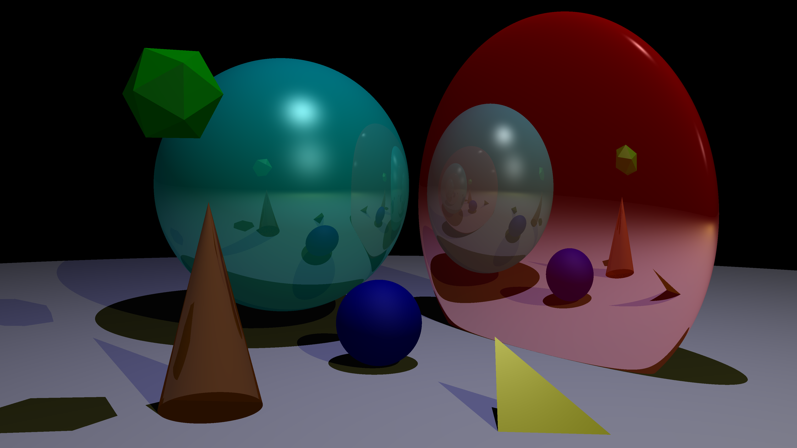
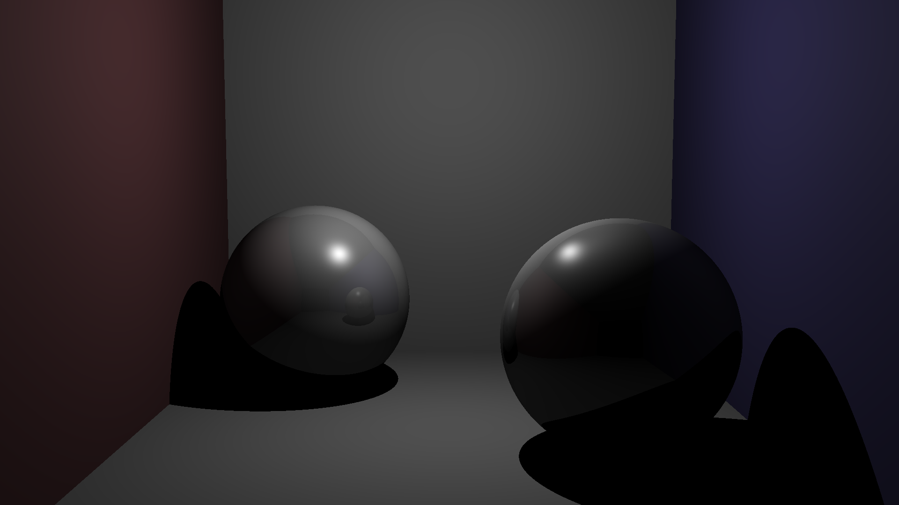

# ZeRaytracer

To compile the program, please use the `make` command if you are on Linux or Mac.

To throw the executable, enter the command `./raytracer` at the root of the project. 
This should, by default, render a 2D scene with a red square in the center. 

To render a specific scene, specify the name of the scene file, where the format is `.ray`.
The `png` files are the renders of the scene files contained inside `scenes/` directory.
To build, your own scene, please refer to the existing scene files.

You can add meshes to your scenes by uploading a `.obj` file to the `meshes/` directory.

Here's some pre-rendered images from the raytracer :

